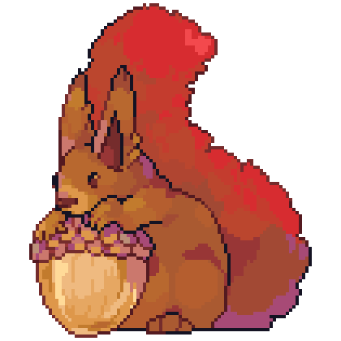

#  Stadians.dev

- Launcher: https://stadia.run
- Data: https://stadia.st/-/skus.json
- Code: https://github.com/stadians/stadians

## Warning

The data update process isn't entirely automated, so we're probably missing recent changes.

## License

All code in this repository are Copyright 2020 Stadians.dev Contributors and released under the [MIT License](https://opensource.org/licenses/MIT).

By intentionally submitting code for inclusion in this repository, you agree to release it under the above license.

The "Stadian Squirrel" icon is Copyright 2020 [illufinch](https://twitter.com/illufinch), and is only licensed for non-commercial use on stadians.dev, stadia.run, and stadia.st.

## Contributing

Changes to the `./stadia.run` or `./stadia.st` subdirectories must be made in standalone commits that only modify one of those directories and do not touch anything else. (This is because we split those paths out with git-subtree to deploy them, and that works more smoothly with distinct commits.)

### Warnings

This repo and this code is a jumbled mess. I'll fix it up as I have time.

Some of the scripts run on Linux, but others only run on MacOS Unix.

There's a bunch of code for a half-built Chrome extension for spidering the Stadia store, but it's mostly just there for reference as I strip it down and replace it. Most of the .vscode config is also related to that.

### Design of stadia.run

The goal for stadia.run is to be an extremely fast way to access your games. In service of that, `index.html` needs to include everything required to do that directly inline: styles, scripts, and micro thumbnail placeholders for game covers. Supplemental scripts and high-resolution images can be loaded later, but they shouldn't block any of the main interactions.

However, I also want to keep this code as minimal as possible. So I'm not using any frameworks or build tools like React of WebPack. Instead, the page itself includes some very simple "dev tools" which you can activate by pressing <kbd>F12</kbd>. The idea is that the these tools will let you import new data to update the page and generate the new `index.html` in the browser. (Currently, these tools are pretty broken and incomplete.)

For desktop browsers, I only care about supporting whatever Stadia supports, so that means we can take advantage of all of the new features that evergreen Chromium browsers have shipped.
